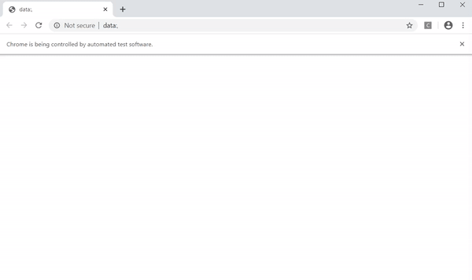

Hi!
I am Brian, an undergraduate student at the [University of Maryland, College Park](https://www.cs.umd.edu/). I am currently pursuing my Bachelor degree in Computer Science, focusing on Data Science; with minor in Actuarial Mathematics and Technology Entrepreneurship.

I have jobs experiences working in Citibank and Deloitte Consulting. I did my last internship in Citibank as a summer analyst in GCB (Global Consumer Banking) Operation and Technology, working on Citi's data center onshoring project. Additionally, I did my internship in Deloitte Consulting, working on enterprise architecture for client's digitalization project. 

Currently, I am doing my research with [Perception and Robotics Group at the University of Maryland, College Park](http://prg.cs.umd.edu/). My current research is on improving speech recognition in adverse condition.

I am currently looking for a full time opportunity as a software engineer or a software developer. I am open to other technology positions as well.

# Projects

## [Newspaper Search](https://github.com/NatBrian/Newspapers_Search_collaboration) 
* Overview: Web scraping automation tool to detect threat words and build the data set from Newspapers
* Languages: Python (Selenium and Beautifulsoup), JavaScript

 

*(Preview of Selenium with Chrome Driver)*

## [Speech Recognition](https://github.com/NatBrian/NG_Speech_to_Text_collaboration)
* Overview: Speech to Text Application using APIs (Google Cloud, Wit.ai, and more)
* Language: Python

*(Preview of Wit.ai with sample audio files)*

## [Video Player](https://github.com/NatBrian/VideoPlayer)
* Overview: Video Player with additional features such as recording time stamps
* Languages: HTML, CSS, JavaScript

*(Demo)*

## [Data Science Pipeline Tutorial](https://github.com/NatBrian/Data-Science-Tutorial)
* Overview: Tutorial that runs the entire data science pipeline: data curation, parsing, and management; exploratory data analysis; hypothesis testing and machine learning to provide analysis on Global Terrorism from 1970 to 2017
* Language: R

*(Preview of the interactive map on terrorist attacks on the U.S.)*

## Multithreaded Maze Solver
* Overview: Maze solver using thread pool and DFS approach
* Language: Java

*(Preview of maze solver speed comparison)*

## Simple Calendar
* Overview: Learn how Web Application Frameworks like Python Django work, and how they interact with the underlying data store
* Language: Django, SQLite3

*(Preview of the Calendar Site)*

# VR Birthday 
* Overview: Animated VR 
* Engine: Unity

*(VR demo)*

# [Design SG-Tree and SG-KD-Tree Data Structure](https://github.com/NatBrian/SG-Data-Structure)
* Overview:
  *	Designed SG-Tree, a self-balancing data structure that combined scapegoat tree and extended binary tree properties.
  *	Designed SG-KD-Tree, a dynamic DS for geometric point sets that combines subtree rebuilding with an extended tree. The SG kd-tree has features in common to both the extended version of the scapegoat tree (our SG tree) and kd-trees
* Language: Java

# Intro to Web Security
* Overview:
  *	Designed a fundamental web security defense with Ruby that protects user’s password with hashing.
  *	Patched the web vulnerability against buffer overflow, shell injection, path traversal, and SQL injection.
* Language: Ruby

# Small-C Parser and Interpreter
* Overview:
  *	Created lexer and parser for Small-C with OCaml, that capable of parsing expressions, statements, and full programs.
  *	Implemented a small subset of an interpreter for Small-C that supports math and Boolean operations and control flow.
* Language: OCaml

*(Preview of running Small-C sample programs)*

# UNIX shell
* Overview:
  * Developed a UNIX shell with C language that has basic UNIX shell commands and functions with extra features.
  *	Modified the UNIX shell to supports “&&” operator, input and output redirection, piping, and subshells.
* Language: C

*(Preview of d8sh shell)*

# CV

## Education
======
* B.S. in Computer Science, University of Maryland - College Park, 2016

## Work experience
======
* **Perception & Robotics Group at the University of Maryland**: Research Assistant - 2019
  * Researched on improving data scraping efficiency to increase productivity in collecting data for machine learning.
  *	Researched on detecting the frequency of threat words in newspapers by building a web scraping automation system.
  *	Researched on speech recognition APIs (Google, Wit.AI, DeepSpeech) and create a better automatic transcribing tool

* **Citibank**: Summer Analyst in Operation and Technology - 2019
  * Worked on Citi’s data center on shoring project and assisted the project manager in setting up the Citi’s data centers.
  * Organized and controlled application testing with 28 consumer banking departments to test 15 core banking systems.
  * Coordinated Citi’s team and key stakeholders (VISA and MasterCard) for networks and firewalls implementation.
  * Executed applications testing successfully, and completed networks installation and testing with Citi’s partners.
  
* **Deloitte**: Summer Analyst - 2018
  * Worked digitalization project of Leading Japanese OEM Auto Manufacturer for business and manufacturing processes.
  * Assisted project manager to coordinate meetings with 39 departments and prepared steering committee meeting.
  * Collected summaries of pain points and business requirements from each stakeholder.
  * Collaborated with team members in preparing deliverables to find the right technology to solve key pain points.
  
* **University of Maryland**: Academic Tutor - 2018
  * Tutored students in object-oriented programming, computer systems, and calculus.
  * Helper students individually to do assignments and prepare for exams.

## Programming Languages
======
* Java
* Python 
* C
* Ruby
* R
* PostgreSQL
* JavaScript
* HTML5
* OCaml
* Rust
* CSS
* assembly

## Leadership
======
* President of Association of Indonesian Students at the University of Maryland: 2016 - 2020
* Volunteered in Harlan, KY on adressing social issues in Appalachian Culture: 2018
* Volunteered in Columbia, SC on adressing childhood healthcare and education: 2017
