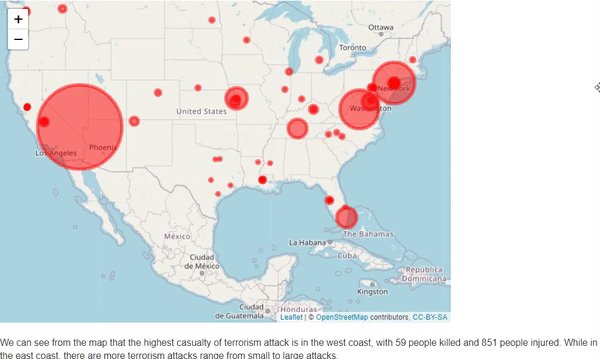


# [Newspaper Search](https://github.com/NatBrian/Newspapers_Search_collaboration) 
* Overview: Web scraping automation tool to detect threat words and build the data set from Newspapers
* Languages: Python (Selenium and Beautifulsoup), JavaScript

 

*(Preview of Selenium with Chrome Driver)*

# [Speech Recognition](https://github.com/NatBrian/NG_Speech_to_Text_collaboration)
* Overview: Speech to Text Application using APIs (Google Cloud, Wit.ai, and more)
* Language: Python

*(Preview of Wit.ai with sample audio files)*

# [Video Player](https://github.com/NatBrian/VideoPlayer)
* Overview: Video Player with additional features such as recording time stamps
* Languages: HTML, CSS, JavaScript

*(Demo)*

# [Data Science Pipeline Tutorial](https://github.com/NatBrian/Data-Science-Tutorial)
* Overview: Tutorial that runs the entire data science pipeline: data curation, parsing, and management; exploratory data analysis; hypothesis testing and machine learning to provide analysis on Global Terrorism from 1970 to 2017
* Language: R

*(Preview of the interactive map on terrorist attacks on the U.S.)*

# Multithreaded Maze Solver
* Overview: Maze solver using thread pool and DFS approach
* Language: Java

*(Preview of maze solver speed comparison)*

# Simple Calendar
* Overview: Learn how Web Application Frameworks like Python Django work, and how they interact with the underlying data store
* Language: Django, SQLite3

*(Preview of the Calendar Site)*

# VR Birthday 
* Overview: Animated VR 
* Engine: Unity

*(VR demo)*

# [Design SG-Tree and SG-KD-Tree Data Structure](https://github.com/NatBrian/SG-Data-Structure)
* Overview:
  *	Designed SG-Tree, a self-balancing data structure that combined scapegoat tree and extended binary tree properties.
  *	Designed SG-KD-Tree, a dynamic DS for geometric point sets that combines subtree rebuilding with an extended tree. The SG kd-tree has features in common to both the extended version of the scapegoat tree (our SG tree) and kd-trees
* Language: Java

# Intro to Web Security
* Overview:
  *	Designed a fundamental web security defense with Ruby that protects user’s password with hashing.
  *	Patched the web vulnerability against buffer overflow, shell injection, path traversal, and SQL injection.
* Language: Ruby

# Small-C Parser and Interpreter
* Overview:
  *	Created lexer and parser for Small-C with OCaml, that capable of parsing expressions, statements, and full programs.
  *	Implemented a small subset of an interpreter for Small-C that supports math and Boolean operations and control flow.
* Language: OCaml

*(Preview of running Small-C sample programs)*

# UNIX shell
* Overview:
  * Developed a UNIX shell with C language that has basic UNIX shell commands and functions with extra features.
  *	Modified the UNIX shell to supports “&&” operator, input and output redirection, piping, and subshells.
* Language: C

*(Preview of d8sh shell)*
